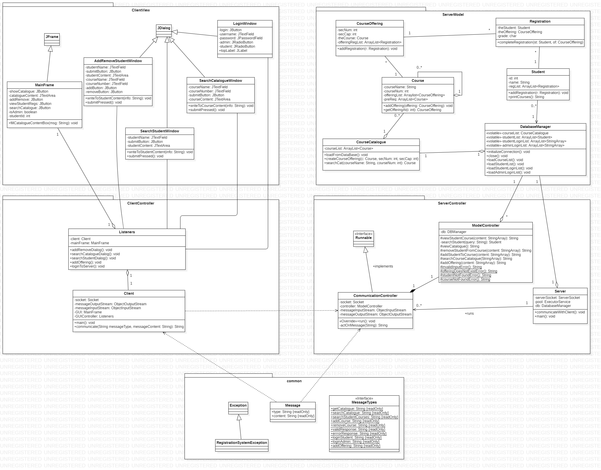

# CourseRegistrationSystem
ENSF 409 Term Project - Winter 2020


## Project Details
Click [here](https://github.com/lukegarland/CourseRegistrationSystem/blob/master/ENSF409-Project-Winter2020-FinalVersion.pdf) and [here](https://github.com/lukegarland/CourseRegistrationSystem/blob/master/ENSF409-LabAssignment3-Winter2020.pdf) to view the details about this project specified by the ENSF 409 instructor Mohammad Moshirpour.
The following bonus marks have been successfully implemented and tested:

- Deploy the project; run the server and client on separate machines (5 marks)
- Maintain a list of users and develop login/out feature (5 marks)
- Create a separate GUI for an “Admin” with the functionality of creating new courses (10 marks)

## Prerequisites
You must have a MySQL database running and the relevant information in ```serverModel/JBDCCredentials.java``` must be correct. To populate the MySQL database with test data, ensure there is a new (empty) schema called 'mydb' and then run the class ```serverModel.DBManager```.

## Running the project
3 Options to run this software (located in ```Milestone2-3```), assuming the mySQL database is set up:

1. Set this repository as your eclipse workspace, and import ```Milestone2-3``` as an eclipse project. Then run ```serverController.server``` to start the server, and ```clientController.client``` to start the client.

2. Run the following commands in the command line to compile and run the project:
    ``` bash
    cd Milestone2-3
    # To compile/build all:
    CourseRegistrationSystem/Milestone2-3$ javac -d bin -classpath lib/* src/*/*.java

    # To run server:
    CourseRegistrationSystem/Milestone2-3$ java -classpath "bin:lib/*" serverController.Server

    # To run client:
    CourseRegistrationSystem/Milestone2-3$ java -classpath "bin" clientController.Client

    ```

3. Run the server using ```Server.jar``` and run the Client using ```Client.jar```. Ensure port 8099 is open on the localhost.


**Notes**:
- Line 82 in ```clientController/Client.java``` states the serverName and port number. You may change these if the server is not running on the localhost. The server must be on Localhost:8099 if the project is used using option \#3.
- Option 2 has been tested on Windows 10 WSL 2 (Ubuntu 18.04.3 LTS on Windows 10 x86_64).


## Authors
* **Luke Garland** - [Github](https://github.com/lukegarland) - [Email](mailto:luke.garland1@ucalgary.ca)

* **Cameron Faith** - [Github](https://github.com/cmrnfaith) - [Email](mailto:cameron.faith1@ucalgary.ca)

* **Guillaume Raymond-Fauteux** - [Github](https://github.com/GuillaumeFISH) - [Email](mailto:guillaume.raymondfau@ucalgary.ca)

See also the project's [commit history](https://github.com/lukegarland/CourseRegistrationSystem/commits/master).


## UML Diagram of this project



#### Dev notes:
 - Set ```CourseRegistrationSystem``` as your Eclipse Workspace.
 - Pre-project exercise, Milestone I, Milestone II and Milestone III will be their own eclipse projects within the workspace.
 - Ensure that you are in the dev branch if you are developing/experimenting with code. Once code is fully tested and correct, create a pull request on github and merge into the master branch.
